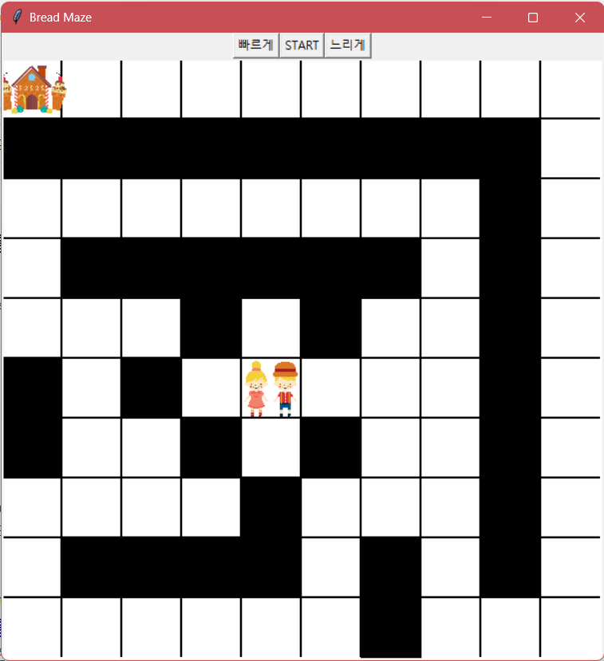
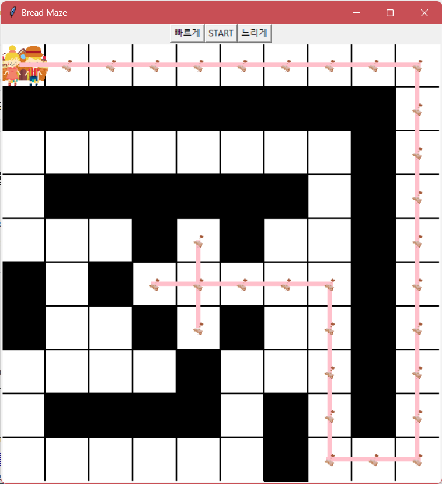

# Maze

- Inspired by the fairytale *Hansel and Gretel*
- Hansel and Gretel walk through the maze, dropping bread. If they encounter a wall, they go back, following the bread they dropped.

````diff
- A.txt
txt file describes starting point, destination, and the wall of the maze

- mazeGUI.py
Execution code of maze
Print the given maze, print images, and print lines of the route

- Maze.py
Code for finding the correct route

- StackQueue.py
Stack and queue to store route
````

##### Sample images

 &nbsp;&nbsp; 

 &nbsp;&nbsp; 

 &nbsp;&nbsp; 
